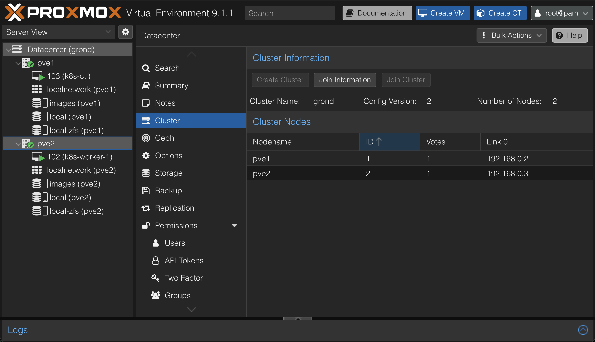
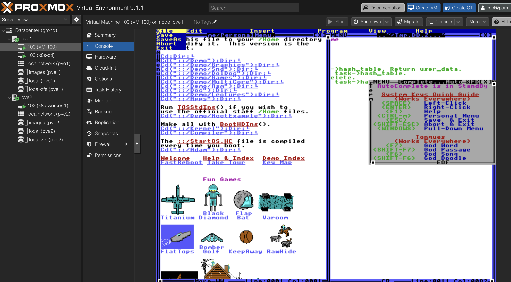

# Curiosity Report (Proxmox)

## Introduction
I chose *Proxmox* because I think it's a neat compliment and contrast to the AWS coursework we've had in this class. A lot of the class instructs how different public cloud technologies can be used to enhance the reliability of an application. I wanted to explore the _private_ cloud, and what tools exist for managing distributed systems without relying on AWS or other public cloud providers.

## What is Proxmox?
Proxmox is a like a data center OS. It's a _virualization hypervisor_ that can turn one or more physical computers (nodes) into a highly-available, secure, and cohesive cluster. It's often described as a tool for creating your own AWS at home (In fact, it's a popular choice for homelabbers! See my Proxmox-based homelab, Grond, below!)


## Features
- Cluster multiple computers together
- Spin up, configure, and clone VMs (similar to EC2)
- Seamlessly migrate VMs between nodes on the cluster
- Use LXC based containers (similar to Docker)
- Storage mount and volume management
- Network configuration tools (such as bridges, VLANs, NICs, and per-VM IP configuration)
- Multi-user management (with Authentication provider integration, RBAC, and more)
- Integration with IAC tools like Terraform and Ansible

## How it's structured
Proxmox clusters are made of several physical computers, or nodes. Each runs a set of VMs and containers. Those VMs can be configured to be "highly available" across nodes, so if a node were to fail the VMs can stay active.

Not only are the nodes shown below in the same cluster, they've also been given access to shared storage.

```mermaid
graph TD

%% Top Level
DC[Datacenter]

%% Cluster
DC --> CL[Proxmox Cluster]

%% Nodes
CL --> N1[Node 1]
CL --> N2[Node 2]

%% Node 1 Details
subgraph Node1_Details [Node 1]
    N1_VM1[VM 101]
    N1_VM2[VM 102]
    N1_CT1[CT 201]
    N1_Storage[Local Storage]
end

%% Node 2 Details
subgraph Node2_Details [Node 2]
    N2_VM1[VM 103]
    N2_CT1[CT 202]
    N2_CT2[CT 203]
    N2_Storage[Local Storage]
end

%% Connect Nodes to their resources
N1 --> N1_VM1
N1 --> N1_VM2
N1 --> N1_CT1
N1 --> N1_Storage

N2 --> N2_VM1
N2 --> N2_CT1
N2 --> N2_CT2
N2 --> N2_Storage

%% Shared Storage
DC --> SS[Shared Storage (NFS / Ceph)]
SS --> N1
SS --> N2

%% Network
NET[Virtual Network Bridge]
N1_VM1 --> NET
N1_VM2 --> NET
N1_CT1 --> NET
N2_VM1 --> NET
N2_CT1 --> NET
N2_CT2 --> NET
```

Here's a screenshot of a basic setup in my homelab (bare-bones, just tried this out for this report so no judgment!)


## General Setup steps
These are a set of steps I remember needing to follow to get this setup.

### 1. Find some nodes 
Ebay and the BYU OIT Surplus shop are beautiful places to find cheap, pre-loved hardware that make for great server nodes. I've also heard of people stringing together old laptops or Raspberry Pis or other SBCs
### 2. Wire them up 
Power and internet are the two big things. I've got an ethernet switch sitting between my two nodes, maybe you could get away plugging right into your router. Mileage may vary. If you want to get really fancy you could explore getting a KVM Switch (Keyboard, Video, Mouse) so you can interact with the bare metal of each machine when needed. Maybe one day if I ever have a few more nodes I'll do that for Grond
### 3. Install Proxmox on each machine 
Use Rufus or Balena Etcher to prepare a thumbdrive with the Proxmox VE found at https://www.proxmox.com/en/downloads/proxmox-virtual-environment/iso. Install it on each machine, following the configuration wizard each time. This is where you define hostnames, IPs, and other settings for the machine. 
### 4. Configure the cluster
Follow the official documentation [here](https://pve.proxmox.com/pve-docs/chapter-pvecm.html) for creating a cluster. It's easier to use the GUI based instructions it includes for creating a cluster and joining nodes into the cluster.
### 5. Start a VM or two
Follow the instructions given [here](https://support.us.ovhcloud.com/hc/en-us/articles/360010916620-How-to-Create-a-VM-in-Proxmox-VE) to create a VM. Any sort of VM will do! Ubuntu-server is a safe bet for getting real work done. To go further, look for the ubuntu live server ISO, which is stripped down and is sortof like what you'd get from spinning up an Ubuntu EC2 instance. But you can also have some fun! I'd like to try loading SteamOS onto a VM to see how it fares. Here's a screenshot of me trying out TempleOS on a VM:

### 6. Make it Sick
Now that everything is working, take some pride in this thing! Stick it in a nice rack. I 3D printed Grond's rack based on [this model](https://www.printables.com/model/1225275-modular-10-server-rack-mod10), but there's all kinds of places you could take it!

## IAC
Here are some snippets from my Terraform to offer examples of how you could setup IAC for defining VMs or nodes on the cluster

```terraform
# Defining the proxmox provider
terraform {
  required_providers {
    proxmox = {
      source  = "bpg/proxmox"
      version = "0.97.1"
    }
  }
}

provider "proxmox" {
  endpoint  = "https://pve1.home:8006"
  api_token = var.pve_api_token
  insecure  = true

  ssh {
    agent       = false
    private_key = file("~/.ssh/id_ed25519")

    node {
      name    = "pve1"
      address = "pve1.home"
    }

    node {
      name    = "pve2"
      address = "pve2.home"
    }
  }
}
```
```terraform
# Define VMs
variable "vms" {
  description = "Map of VMs to create. Each VM can override name, node, cpu, ram, disk size, and network settings."
  type = map(object({
    name         = string
    node_name    = string
    cpus         = number
    ram_mb       = number
    disk_size_gb = number
    ipv4_address = string
    ipv4_gateway = string
    username     = optional(string, "ubuntu")
    bridge       = optional(string, "vmbr0")
  }))
  default = {
    "k8s-ctl" = {
      name         = "k8s-ctl"
      node_name    = "pve1"
      cpus         = 2
      ram_mb       = 2048
      disk_size_gb = 20
      ipv4_address = "192.168.0.251/24"
      ipv4_gateway = "192.168.0.1"
    }
    "k8s-worker-1" = {
      name         = "k8s-worker-1"
      node_name    = "pve2"
      cpus         = 5
      ram_mb       = 8192
      disk_size_gb = 60
      ipv4_address = "192.168.0.252/24"
      ipv4_gateway = "192.168.0.1"
    }
  }
}

```

## So, why?
We have all sorts of public cloud options, from AWS to Digital Ocean... why would a person or group choose to build and maintain their own datacenter with tools like Proxmox or Kubernetes instead of using a cloud provider?

Turns out [there are a few good reasons](https://world.hey.com/dhh/why-we-re-leaving-the-cloud-654b47e0) why some organizations choose private (on-prem) over public cloud:

### Cost
Cloud computing is very cost effective compared to maintaining your own machines most of the time, especially when your volume to serve is unpredictable. But some organizations _can_ reliably predict the volume of traffic they will serve, so pricey elasticity is less important. For example, while Meta reacts to 100s of millions of users in real-time, with varing usage patterns and unexpected spikes, a lawfirm's internal IT systems deal much less with variadic traffic and doesn't need to scale quickly. They could be more likely to save with their own hardware compared to the public cloud.

### Control
Maintaining your own hardware and infrastructure comes with the benefit of fewer mysteries and usually less complexity. An expert on the on-prem system can know top-to-bottom where an issue might be or what opportunties for improvement there are. (Of course, this comes at the cost of _having_ such an expert, which can be pricey depending on needs and scale.)

### Security
Sharing hardware with strangers can bring some compliance and security headaches. Depending on the industry, government authorities like HIPAA, PCI DSS, and the US DoD can impose requirements that are more easily fulfilled in a private cloud than in a public cloud. This steers many organizations in the on-prem direction.

## Where to next?
Kubernetes and Proxmox are two peas in a pod. My next learning path will be to use the proxmox cluster to house a Kubernetes cluster. Then introduce concepts like GitOps using ArgoCD or FluxCD.
